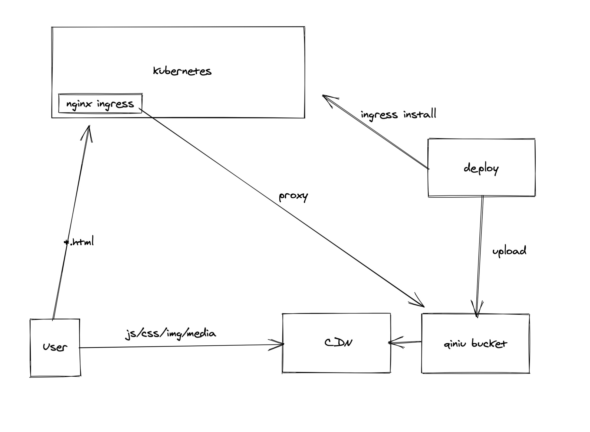

# 前端k8s部署示例

### 依赖
- node >= 11
- helm

### 架构图



### 运行
```
yarn
```

```
BUCKET="bp-stage" \
BUCKET_HOST="//bg-stage.wkcoding.com/" \
QINIU_AK="" \
QINIU_SK="" \
RESOURCES_PREFIX="wixland/pro" \
bash ./scripts/deploy.sh
```